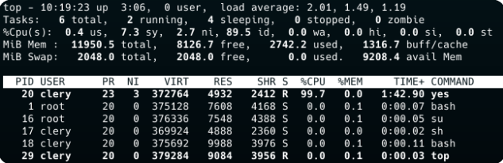

# Documentation My_Top

Bienvenue sur la documentation du header

Le header affiche les informations systèmes comme :

-l'heure actuelle

-le nombre d'utilisateurs

-le nombre de tâches en cours

-La mémoire et mémoire swap total, disponible et utilisée
 

Fait par | [Julien LEINER ](https://github.com/Julien-Lnr) 