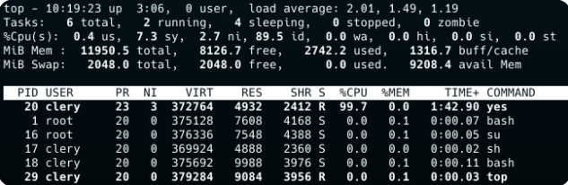

# Documentation My_Top

Bienvenue sur la documentation du projet My_Top

Il s'agit du projet de 1ère année à Epitech

Il fut réalisé seul

L'objectif est de refaire la commande existante top en utilisant ncurses.

Il est composé en 2 parties :

- Le header du top
- La partie basse

Fait par | [Julien LEINER ](https://github.com/Julien-Lnr) 