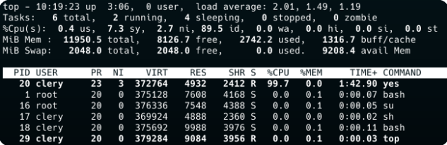

# Documentation My_Top

Bienvenue sur la documentation du footer

Le footer affiche les informations sur les processus comme :

-le PID

-l'utilisateur qui l'a démarré

-Le pourcentage du CPU et de la mémoire utilisé

-le nom du processus
 

Fait par | [Julien LEINER ](https://github.com/Julien-Lnr) 